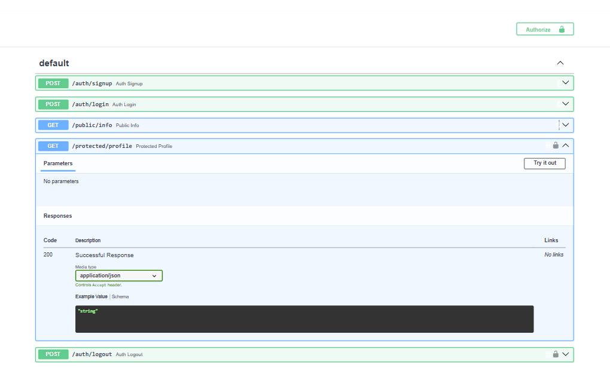

# Authentication Practice API

A secure **FastAPI backend** demonstrating user authentication and protected API routes using **Supabase Auth** and **JWT Bearer tokens**.

This project was built as part of the **FLYRANK Internship – Backend Track, Week 2, Assignment A4: Auth · Login & Protect**.

## What This Project Demonstrates

* User sign-up with Supabase Auth
* User login and JWT access tokens
* Bearer token authentication
* JWT verification through Supabase
* Reusable authentication dependency for protected routes
* Protected profile and logout endpoints
* Public API endpoint
* Swagger UI documentation with bearer authentication
* Environment variables and secret management
* Git/GitHub version control

## Tech Stack

* **Python 3.10+**
* **FastAPI**
* **Supabase Auth**
* **JWT / Bearer Authentication**
* **Swagger UI / OpenAPI**
* **python-dotenv**
* **Git & GitHub**

## Project Structure

```text
authenticationPractice/
│
├── main.py
├── database.py
├── requirements.txt
├── .env.example
├── .gitignore
└── README.md
```

> The exact files may vary depending on the final project structure.

## How Authentication Works

The authentication flow is:

```text
Client
   │
   │ email + password
   ▼
Supabase Auth
   │
   │ access token (JWT)
   ▼
Client
   │
   │ Authorization: Bearer <token>
   ▼
FastAPI
   │
   │ verify token with Supabase
   ▼
Protected Route
```

Supabase handles the user accounts, passwords, and token generation.

The FastAPI application is responsible for extracting the bearer token, verifying it, and allowing or rejecting access to protected routes.

## Setup

### 1. Clone the Repository

```bash
git clone https://github.com/waniamaqsood/authenticationPractice.git
cd authenticationPractice
```

### 2. Create a Virtual Environment

```bash
python -m venv venv
```

Activate it on Windows:

```powershell
venv\Scripts\activate
```

### 3. Install Dependencies

```bash
pip install -r requirements.txt
```

### 4. Configure Environment Variables

Create a `.env` file in the project root:

```env
SUPABASE_URL=your_supabase_project_url
SUPABASE_KEY=your_supabase_anon_key
```

Use `.env.example` as a template.

> **Security:** Do not commit the `.env` file or real Supabase keys to GitHub.

## Run the API

Start the FastAPI server with:

```bash
uvicorn main:app --reload
```

The API will run at:

```text
http://127.0.0.1:8000
```

Interactive Swagger documentation is available at:

```text
http://127.0.0.1:8000/docs
```

## API Reference

| Method | Endpoint             | Purpose                                 | Authentication  |
| ------ | -------------------- | --------------------------------------- | --------------- |
| `POST` | `/auth/signup`       | Create a new user account               | ❌ No            |
| `POST` | `/auth/login`        | Authenticate a user and return tokens   | ❌ No            |
| `POST` | `/auth/logout`       | Log out the authenticated user          | 🔒 Bearer token |
| `GET`  | `/protected/profile` | Return the authenticated user's profile | 🔒 Bearer token |
| `GET`  | `/public/info`       | Return publicly accessible information  | ❌ No            |

## Authentication

Protected endpoints require an access token in the HTTP `Authorization` header:

```http
Authorization: Bearer <access_token>
```

The token is obtained from the login endpoint.

### Example Login Response

```json
{
  "access_token": "eyJ...",
  "refresh_token": "..."
}
```

The access token can then be used to access protected routes.

## Protected Profile

### Request

```http
GET /protected/profile
Authorization: Bearer <access_token>
```

A valid token returns the authenticated user's information.

An absent, malformed, invalid, or expired token returns one of the following responses:

```json
{
  "error": "Access token required"
}
```

or:

```json
{
  "error": "Invalid or expired token"
}
```

with a `401 Unauthorized` status.

## Swagger UI

The API includes interactive Swagger documentation at:

```text
http://127.0.0.1:8000/docs
```

The protected endpoints display a **lock icon** and support bearer-token authorization through Swagger's **Authorize** button.

After entering a valid access token, the `/protected/profile` endpoint can be executed directly from the browser.

### Swagger Screenshot

Save the final Swagger screenshot inside the repository, for example:

```text
docs/swagger-auth.png
```

Then add it to this README:

```markdown

```

The screenshot should show:

* The protected `/protected/profile` route
* Its lock icon
* The Swagger **Authorize** button
* A successful response after authorization

## Security

The project follows several basic security practices:

* Passwords are handled by Supabase Auth rather than stored by the API.
* JWTs are verified before protected routes are executed.
* Protected routes use a reusable authentication dependency.
* Supabase credentials are stored in environment variables.
* `.env` is excluded through `.gitignore`.
* `.env.example` contains only placeholder values.
* The Supabase `service_role` key is not used or committed.

## HTTP Status Codes

| Status | Meaning      | Example                            |
| ------ | ------------ | ---------------------------------- |
| `200`  | OK           | Successful login/profile request   |
| `201`  | Created      | Successful signup                  |
| `204`  | No Content   | Successful logout                  |
| `400`  | Bad Request  | Missing signup/login information   |
| `401`  | Unauthorized | Missing, invalid, or expired token |

## Testing

The API was tested using both **terminal requests** and **Swagger UI**.

### Public Endpoint

```bash
curl -i http://127.0.0.1:8000/public/info
```

Expected:

```text
200 OK
```

### Protected Endpoint Without a Token

```bash
curl -i http://127.0.0.1:8000/protected/profile
```

Expected:

```text
401 Unauthorized
```

### Protected Endpoint With a Valid Token

```bash
curl -i http://127.0.0.1:8000/protected/profile \
  -H "Authorization: Bearer <YOUR_ACCESS_TOKEN>"
```

Expected:

```text
200 OK
```

## Learning Outcome

This project demonstrates the difference between **authentication** and **authorization** and shows how a backend can use an external **Identity Provider** to securely manage users and verify access tokens.

Instead of implementing password hashing or cryptography manually, the application delegates account and token management to **Supabase** and focuses on securely verifying tokens and protecting API routes.
